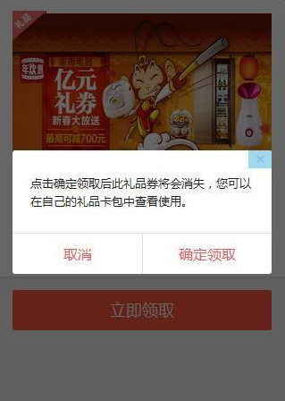

>大家好，这里是「 从零开始学 Web 系列教程 」，并在下列地址同步更新......
>
> - github：https://github.com/Daotin/Web
> - 微信公众号：[Web前端之巅](https://github.com/Daotin/pic/raw/master/wx.jpg)
> - 博客园：http://www.cnblogs.com/lvonve/
> - CSDN：https://blog.csdn.net/lvonve/
>
> 在这里我会从 Web 前端零基础开始，一步步学习 Web 相关的知识点，期间也会分享一些好玩的项目。现在就让我们一起进入 Web 前端学习的探索之旅吧！


## 一、touch事件的缺陷

我们在上面《页面分类》的项目中，对 tap 事件的处理使用的是 touch 事件处理的，因为如果使用 click 事件的话，总会有延时。

但是呢，touch 事件并不是完美的，不管是我们自己封装的 tap 事件，还是 zepto 自带的 tap 事件，在移动端都有一个致命的缺陷，就是“**点透**”。

**什么是“点透”呢？**

假如有两个盒子，盒子A和盒子B，如果盒子A在盒子B的上面，当我们使用 tap 事件点击盒子A的时候，盒子B会触发 click 事件，这就是点透。



触发这两个事件的顺序是 tap 事件，然后是 click 事件。因为 tap 事件内部是 touch 事件处理的，而 touch 事件是先于 click 事件触发的。

这个时候，我们既想无延时，又不想触发点透效果，而且有的时候，我们希望我们的网页不仅可以在移动端访问，在 PC 模式下也可以访问，但是 tap 事件只能在移动端使用，所以只能用 click 事件，但是 click 又有延时，怎么办呢？

我们知道， touch 事件只能在移动端使用，这个我们无法改变，所以我们只能改变延时的问题，于是我们就引入了 **"fastclick.js"** 库文件，解决 click 的延时问题。


**使用方式：**

1、引入 fastclick.js 文件。

2、在 script 中加入以下函数：

原生 js 的话，加入：

```js
if ('addEventListener' in document) {
	document.addEventListener('DOMContentLoaded', function() {
      	// document.body 表示整个body下的所有元素都是用fastclick效果，可以修改。
		FastClick.attach(document.body);
	}, false);
}
```

jQuery 或 Zepto 的话：

```js
$(function() {
	FastClick.attach(document.body);
});
```

3、正常使用 `元素.addEventListener("click", function(){})`  或者 `元素.on("click", function(){})` ，来使用改装过后的 click 事件，这个 click 事件没有延时。


## 二、移动端的一些常用插件

见识到 fastclick 插件的好处之后，我们就挖掘出了更多好用的插件，可以大大提高我们开发的效率。


### 1、iScroll

以下为官方介绍：

iScroll是一个高性能，资源占用少，无依赖，多平台的 javascript **滚动** 插件。

它可以在桌面，移动设备和智能电视平台上工作。它一直在大力优化性能和文件大小以便在新旧设备上提供最顺畅的体验。

iScroll不仅仅是 滚动。它可以处理任何需要与用户进行移动交互的元素。在你的项目中包含仅仅4kb大小的iScroll，你的项目便拥有了滚动，缩放，平移，无限滚动，视差滚动，旋转功能。给它一个扫帚它甚至能帮你打扫办公室。

即使平台本身提供的滚动已经很不错，iScroll可以在此基础上提供更多不可思议的功能。具体来说：

细粒度控制滚动位置，甚至在滚动过程中。你总是可以获取和设置滚动器的x，y坐标。
动画可以使用用户自定义的擦出功能（反弹'bounce'，弹性'elastic'，回退'back'，...）。
你可以很容易的挂靠大量的自定义事件（onBeforeScrollStart, *
开箱即用的多平台支持。从很老的安卓设备到最新的iPhone，从Chrome浏览器到IE浏览器。


**使用方式：**

1、希望你的结构如下，但是不限定标签（下面的 ul 可以改为 div，li 可以改为 p 等，不限定标签类型）。

```
<div id="wrapper">
    <ul>
        <li>...</li>
        <li>...</li>
        ...
    </ul>
</div>
```

2、在 script 标签中初始化 iScroll。

```js
var wrapper = document.getElementById('wrapper');
var myScroll = new IScroll(wrapper);
```

如果是 jQuery 的话更简单了，一句话：

```js
var myScroll = new IScroll(".wrapper");
```

3、如果想实现像滚轮，显示滚动条等效果，可以在初始化的时候，将这些需求作为对象，填入第二个参数中，比如，增加滚轮上下滚动操作和显示滚动条的效果：

```js
var myScroll = new IScroll(".wrapper", {
  mouseWheel: true, // 使用滚轮
  scrollbars: true  // 显示滚动条
});
```


如此简单三步操作，就可以轻松实现你想要的功能。


### 2、swipe

swipe.js 是一个比较有名的触摸滑动插件，它能够处理内容滑动，支持自定义选项，你可以让它自动滚动，控制滚动间隔，返回回调函数等。经常作为**轮播图**使用。


**使用方法：**

1、引入 swipe.js 文件

2、希望你的 html 结构为（不限定标签名称）：

```html
<div id='slider' class='swipe'>
  <div class='swipe-wrap'>
    <div></div>
    <div></div>
    <div></div>
  </div>
</div>
```

3、对其格式进行设定（固定写法，最好不要修改，当然类名称需要修改）

```css
.swipe {
  overflow: hidden;
  visibility: hidden;
  position: relative;
}
.swipe-wrap {
  overflow: hidden;
  position: relative;
}
.swipe-wrap > div {
  float:left;
  width:100%;
  position: relative;
}
```

3、在 script 中进行初始化操作：

```js
window.mySwipe = Swipe(document.getElementById('slider'));
```

4、如果你想要自动轮播，滑动等操作，需要在初始化的第二个参数中，引入一个对象，比如：

```js
window.mySwipe = new Swipe(document.getElementById('slider'), {
  startSlide: 2,  // 默认显示第二张图片
  speed: 400,     // 过渡400ms
  auto: 3000,     // 轮播间隔 2s
  continuous: true,  // 循环轮播（默认开启）
  disableScroll: false,  // 禁止滑动（默认关闭）
  stopPropagation: false,
  callback: function(index, elem) {},
  transitionEnd: function(index, elem) {}
});
```

5、当然你还可以在 PC 上使用左右两个按钮来上一张下一张翻页。swipe 会提供 `next()` , `prev()` 等函数来实现上一张下一张翻页。比如：

```js
document.getElementById('btn1').onclick = function(){
  window.mySwipe.prev(); // 调用系统的prev()方法
};

document.getElementById('btn2').onclick = function(){
  window.mySwipe.next(); // 调用系统的next()方法
};
```


### 3、swiper

swiper 与 swipe 类似，都可以提供轮播触摸滑动的效果，只不过 swiper 能够提供的特效更多，更加炫酷，相应的体积也更大。

使用说明： 参考链接：<http://www.swiper.com.cn/usage/index.html>

需要注意的是，swiper 不同于 swipe，它也是结构固定，不限标签的，唯一的区别是类样式的名称是不可改变的。因为它引入了库文件的 css 样式。所以最好不要改变类样式的名称。具体的内容可以参考官网，有很多详细的使用说明和特效演示。


临时Tips：`overflow:hidden` 可以让子元素浮动的父盒子由高度为0，到自动伸缩。


