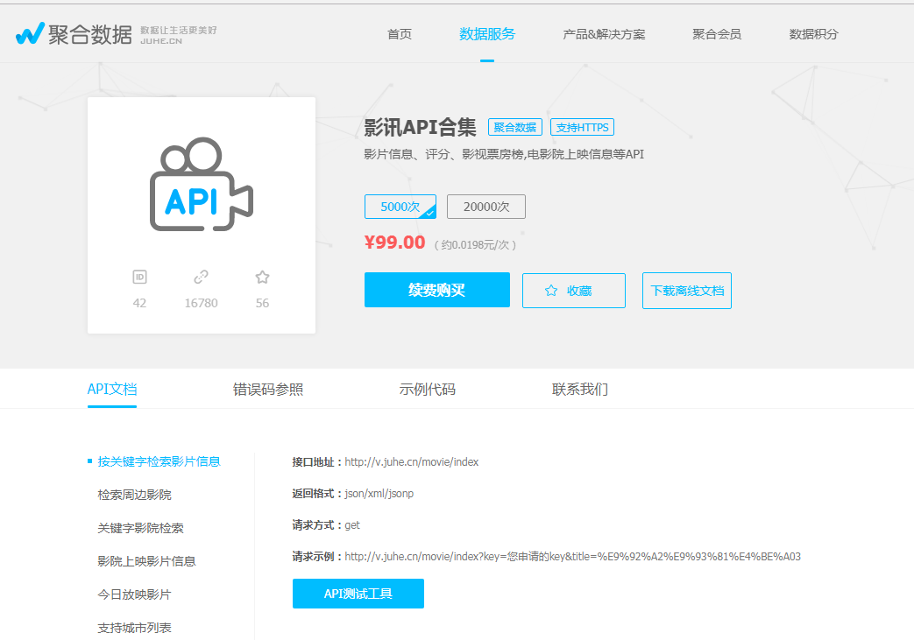
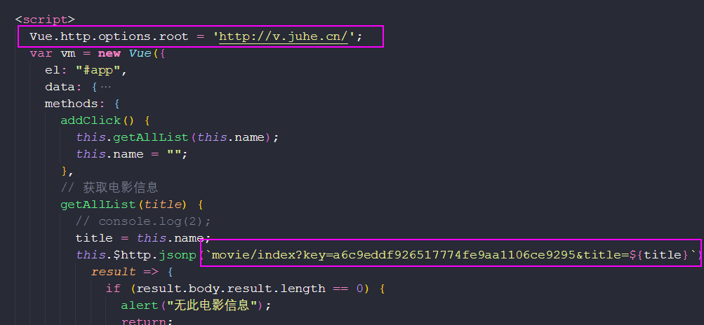

>大家好，这里是「 从零开始学 Web 系列教程 」，并在下列地址同步更新......
>
> - github：https://github.com/Daotin/Web
> - 微信公众号：[Web前端之巅](https://github.com/Daotin/pic/raw/master/wx.jpg)
> - 博客园：http://www.cnblogs.com/lvonve/
> - CSDN：https://blog.csdn.net/lvonve/
>
> 在这里我会从 Web 前端零基础开始，一步步学习 Web 相关的知识点，期间也会分享一些好玩的项目。现在就让我们一起进入 Web 前端学习的冒险之旅吧！


## 一、Vue发送Ajax请求

之前我们发送Ajax请求的方式，一是原生的方式发送，二是通过jQuery来发送Ajax请求。

但是我们知道，在Vue里面是不推荐使用jQuery的，那么如何使用Vue来发送Ajax请求呢？

在Vue中可以**使用第三方插件`vue-resource` 来实现Ajax请求的发送**。


### 1、vue-resource 安装

1、通过npm的方式在线安装：`npm install vue-resource`

2、在 github 中下载 vue-resource 的 文件 （在 dist 文件夹下有个 vue-resource.js 文件。）

3、使用 CDN。`<script src="https://cdn.jsdelivr.net/npm/vue-resource@1.5.1"></script>`


### 2、vue-resource 使用

参考链接：https://github.com/pagekit/vue-resource/blob/develop/docs/http.md

步骤：

1、在Vue.js之后**引入vue-resource.js文件**（因为vue-resource.js文件是依赖于Vue的）

2、全局使用：

then后面第一个参数是请求成功的回调函数；第二个参数是请求失败的回调函数。

**获取到的结果在回调函数的参数中**。

```js
Vue.http.get('/someUrl', [config]).then(successCallback, errorCallback);
Vue.http.post('/someUrl', [body], [config]).then(successCallback, errorCallback);
Vue.http.jsonp('/someUrl', [config]).then(successCallback, errorCallback);
```

3、局部使用：**在methods的事件中**，使用 `this.$http.get/post/jsonp();` 的形式发起请求。

```js
this.$http.get('/someUrl', [config]).then(successCallback, errorCallback);
this.$http.post('/someUrl', [body], [config]).then(successCallback, errorCallback);
this.$http.jsonp('/someUrl', [config]).then(successCallback, errorCallback);
```


**示例**：通过三个按钮点击分别获取get，post，jsonp请求。

```html
<!DOCTYPE html>
<html lang="en">

<head>
    <meta charset="UTF-8">
    <title>Document</title>
    <script src="./lib/vue-2.4.0.js"></script>
    <script src="./lib/vue-resource-1.3.4.js"></script>
</head>

<body>
    <div id="box">
        <input type="button" value="get请求" @click="getClick">
        <input type="button" value="post请求" @click="postClick">
        <input type="button" value="jsonp请求" @click="jsonpClick">
    </div>

    <script>
        var vm = new Vue({
            el: " #box ",
            data: {},
            methods: {
                getClick() {
                    // 参数1：测试用的地址：http://vue.studyit.io/api/getlunbo
                    // 参数2：[config] 可选
                    this.$http.get("http://vue.studyit.io/api/getlunbo").then(result => {
                        console.log("ok");
                        console.log(result.body);
                    });
                },
                postClick() {
                    // 参数1：测试用的地址：http://vue.studyit.io/api/getlunbo
                    // 参数2：[data]数据，可为Object，FormData，String，这里为空
                    // 参数3：[config] 可选，但是emulateJSON = "true" 表名表单格式为：application/x-www-form-urlencoded，否则
                    // 可能有的浏览器不认识。
                    this.$http.post("http://vue.studyit.io/api/post", "", {
                        emulateJSON: true
                    }).then(result => {
                        console.log(result.body);
                    });
                },
                jsonpClick() {
                    this.$http.jsonp("http://vue.studyit.io/api/getlunbo").then(result => {
                        console.log(result.body);
                    });
                }
            }
        });
    </script>
</body>

</html>
```

> 注意：获取到的数据在成功回调函数参数data的中，data是个对象，具体需要的数据是 data.body。


## 二、vue-resource 跨域请求数据

### 1、jsonp的实现原理

jsonp主要是为了**解决跨域请求问题**的。

我们知道，由于浏览器的安全性限制，不允许AJAX访问 **协议不同**、**域名不同**、**端口号不同**的数据接口，浏览器认为这种访问不安全。

但是，**script标签src属性中的链接却可以访问跨域的js脚本**，于是利用这种特性，**我们让服务器不再返回数据，而是返回一段调用某个函数的js代码，然后在script中进行调用**，就实现了跨域。


示例：使用JSONP，添加了一个script标签，标签的src指向了另一个域 www.xxx.com下的 jsonp.js 脚本。

```html
<!DOCTYPE html>
<html>
<head>
    <title>title</title>
</head>
<body>
<script type="text/javascript">
    function jsonphandle(data){
        alert("age:" + data.age + "name:" + data.name);
    }
</script>
<script type="text/javascript" src="jquery-1.8.3.min.js">
</script>
<script type="text/javascript" src="http://www.xxx.com/jsopn.js"></script>
</body>
</html>
```

要实现跨域，所以返回的 js 代码应该是一个函数的调用。www.xxx.com 下的 jsonp.js 代码如下：

```js
jsonphandle({
    "age" : 15,
    "name": "John",
})
```

于是，结果就弹出对话框。


我们再改进一下，在script的src中传入的大多是后台文件，这里以php文件为例。

由于我们之前传入 js 文件只是想得到一个函数的调用而已，那么传入php文件怎么获取函数的调用呢？

```html
<!DOCTYPE html>
<html>
<head>
    <title>GoJSONP</title>
</head>
<body>
<script type="text/javascript">
    function jsonphandle(data){
        alert("age:" + data.age + "name:" + data.name);
    }
</script>
<script type="text/javascript" src="jquery-1.8.3.min.js">
</script>
<script type="text/javascript">
    $(document).ready(function(){
        var url = "http://www.xxx.com/jsonp.php?id=1&callback=jsonphandle";
        var obj = $('<script><\/script>');
        obj.attr("src",url);
        $("body").append(obj);
    });
</script>
</body>
</html>
```

这里动态的添加了一个script标签，src指向跨域的一个php脚本，并且将上面的js函数名作为callback参数传入，那么我们看下PHP代码怎么写的：

```php
<?php
$data = array(
    'age' => 20,
    'name' => '张三',
);

$callback = $_GET['callback'];

echo $callback."(".json_encode($data).")";
return;
```

php代码返回的也是一个函数调用，**我们需要的数据，就在其参数里面**。成功弹出提示框：

```js
jsonphandle({
    "age" : 15,
    "name": "张三",
})
```

最后，jQuery提供了方便使用jsonp的方式：

```html
<!DOCTYPE html>
<html>
<head>
    <title>GoJSONP</title>
</head>
<body>
<script type="text/javascript" src="jquery-1.8.3.min.js">
</script>
<script type="text/javascript">
    $(document).ready(function(){
        $.ajax({
            type : "get",
            async: false,
            url : "http://www.xxx.com/jsonp.php?id=1",
            dataType: "jsonp",
            jsonp:"callback", //请求php的参数名
            jsonpCallback: "jsonhandle",//要执行的回调函数
            success : function(data) {
                alert("age:" + data.age + "name:" + data.name);
            }
        });
    });
</script>
</body>
</html>
```

> 其中参数 data，即为php代码返回的函数调用的参数，就是我们先要的数据。


参考链接：https://blog.csdn.net/u011897301/article/details/52679486


### 2、跨域获取电影信息

这里我使用 **聚合数据**：https://www.juhe.cn 的免费API。




使用方式很简单，注册之后，申请数据后，在个人中心->我的数据,接口名称上方查看key值。

而我们访问的url即为：`http://v.juhe.cn/movie/index?key=您申请的key&title=头文字D`


我们在name输入框中输入电影名称后，点击查询按钮即可显示相关信息。

```html
<!DOCTYPE html>
<html lang="en">

<head>
  <meta charset="UTF-8">
  <meta name="viewport" content="width=device-width, initial-scale=1.0">
  <meta http-equiv="X-UA-Compatible" content="ie=edge">
  <title>Document</title>
  <script src="./lib/vue-2.4.0.js"></script>
  <script src="./lib/vue-resource-1.3.4.js"></script>
  <style>
    * {
      padding: 0;
      margin: 0;
      position: relative;
    }

    /* 实现任意无宽高盒子居中 */

    #app {
      width: 100%;
      position: absolute;
      left: 50%;
      /* top: 100px; */
      transform: translateX(-50%);
    }

    .box {
      width: 100%;
      height: 40px;
      background-color: #ccc;
      display: inline-block;
      text-align: center;
      line-height: 40px;
      border: 1px solid #aaa;
      box-sizing: border-box;
      border-bottom: none;
    }

    .box>input[type="button"] {
      width: 60px;
      background-color: #aaa;
      border: 0;
      border: 1px solid #aaa;
      margin: 0 20px;
    }

    .tb {
      width: 100%;
      height: 100%;
      text-align: center;
      border-collapse: collapse;
      border-color: #ccc;
    }

    .th {
      background-color: rgb(24, 204, 204);
    }
  </style>
</head>

<body>
  <div id="app">
    <div class="box">
      <label for="name">
        电影名:
        <input type="text" id="name" v-model="name">
      </label>
      <input type="button" value="查询" @click="addClick">
    </div>

    <table border="1" cellspacing="0" class="tb">
      <thead class="th">
        <tr>
          <th>年份</th>
          <th>标题</th>
          <th>评分</th>
          <th>类型</th>
          <th>时长</th>
          <th>主演</th>
          <th>简介</th>
          <th>删除</th>
        </tr>
      </thead>
      <!-- 有查询的话，这里就不应该固定死，而是根据keywords动态生成新的数组 -->
      <!-- <tr v-for="item in list"></tr> -->
      <tbody>
        <tr v-for="item in list">
          <td>{{item.year}}</td>
          <td>《{{item.title}}》</td>
          <td>{{item.rating}}</td>
          <td>{{item.genres}}</td>
          <td>{{item.runtime}}</td>
          <td>{{item.actors}}</td>
          <td>{{item.plot_simple}}</td>
          <td>
            <!-- 绑定的事件是可以传参数的，这里传入需要删除的对象id -->
            <a href="javascript:;" @click.prevent="delClick(item.id)">del</a>
          </td>
        </tr>
      </tbody>
    </table>
  </div>


  <script>
    // 全局配置数据接口的根域名
    //Vue.http.options.root = 'http://v.juhe.cn/';
    
    var vm = new Vue({
      el: "#app",
      data: {
        name: "",
        rating: "",
        genres: "",
        runtime: "",
        title: "",
        actors: "",
        plot_simple: "",
        year: "",
        // 假数据
        list: [{
            'rating': 7.3,
            'genres': '动作/惊悚/科幻',
            'runtime': '139分钟',
            "title": "哥斯拉",
            "actors": "马修·布罗德里克",
            "plot_simple": "一道亮光划过天际，太平洋上波涛汹涌",
            "year": "1998",
          },
          {
            'rating': 1,
            'genres': 2,
            'runtime': 3,
            "title": 4,
            "actors": 5,
            "plot_simple": 6,
            "year": 7,
          }
        ]
      },
      methods: {
        // 按钮点击事件处理函数
        addClick() {
          this.getAllList(this.name);
          this.name = "";
        },
        // 获取电影信息
        getAllList(title) {
          // console.log(2);
          title = this.name;
          this.$http.get(`http://v.juhe.cn/movie/index?key=a6c9eddf926517774fe9aa1106ce9295&title=${title}`).then(
            result => {
              if (result.body.result.length == 0) {
                alert("无此电影信息");
                return;
              }
              this.list = result.body.result;
            });
        }
      }

    });
  </script>
</body>


</html>
```


由于API要求我们访问的方式为 get请求，所以我们使用 `this.$http.get` 的方式来获取电影信息。

然后打印获取到的数据result，但是却爆出如下错误信息：


错误信息是表示，无法实现跨域。而我们之前知道 jsonp是可以实现跨域问题的。

于是我将get请求改为jsonp请求：`this.$http.jsonp` 就可以了。


**改进：**

之前直接把数据接口放在了请求地址里面，如果地址变了，就要在请求地址里面修改，如果不止一个还有其他post，get请求等，那么就要修改多次，所以我们有必要动态的指定数据接口。

使用：`Vue.http.options.root = 'http://v.juhe.cn/';` 来指定数据接口的根地址。

我们在请求的时候只需要写 `movie/index?key=a6c9eddf926517774fe9aa1106ce9295&title=${title}` 就可以了。




> 注意：后续地址，不要写 / ，否则就不会将根地址和后续地址进行拼接。


当然，对于我们发给服务器的数据，可能会需要 `emulateJSON = true;` 

我们也可以进行全局配置：`Vue.http.options.emulateJSON = true;`


